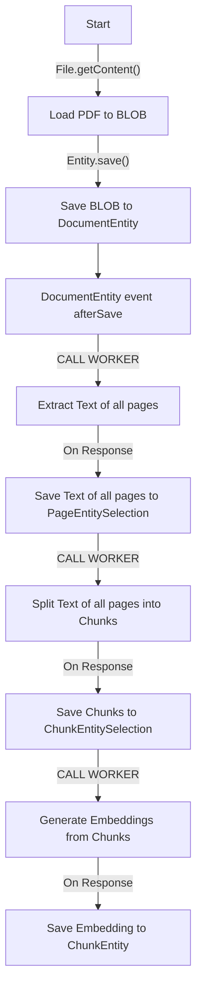

# 4d-example-pdf-chunking
Use llama.cpp to locally process PDF for semantic search

```mermaid
  graph TD;
  A[Start] --> |"File.getContent()"| B[Load PDF to BLOB];
  B --> |"Entity.save()"|C[Save BLOB to DocumentEntity];
  C --> D[DocumentEntity event afterSave];
  D --> |CALL WORKER| E[Extract Text of all pages];
  E --> |On Response| F[Save Text of all pages to PageEntitySelection];
  F --> |CALL WORKER| G[Split Text of all pages into Chunks];
  G --> |On Response| H[Save Chunks to ChunkEntitySelection];
  H --> |CALL WORKER| I[Generate Embeddings from Chunks];
  I --> |On Response| J[Save Embedding to ChunkEntity];
```

## Screenshots

* Catalog

* MSC > Information > Tables
  

